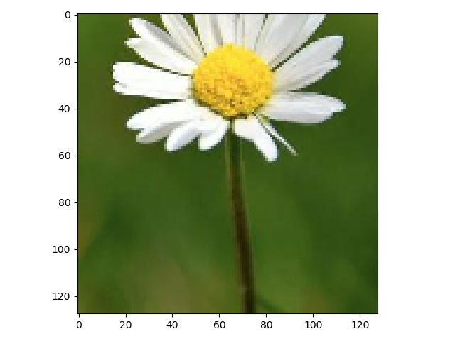
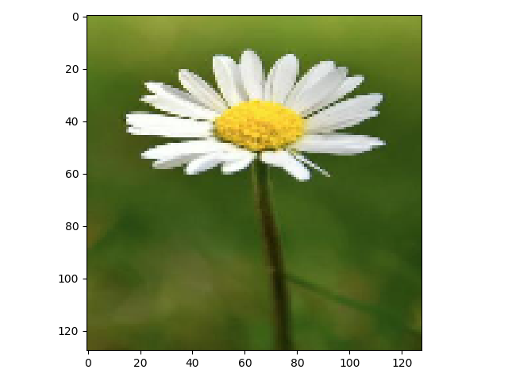
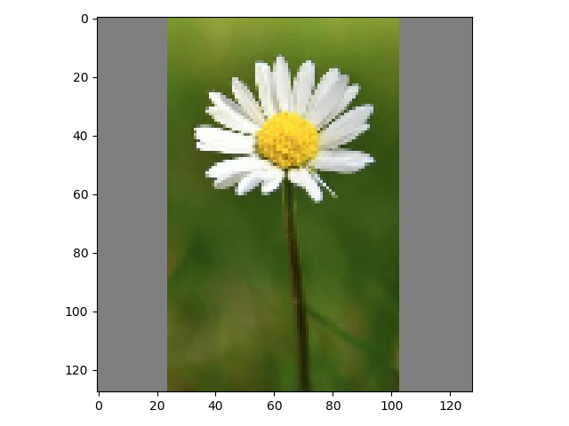
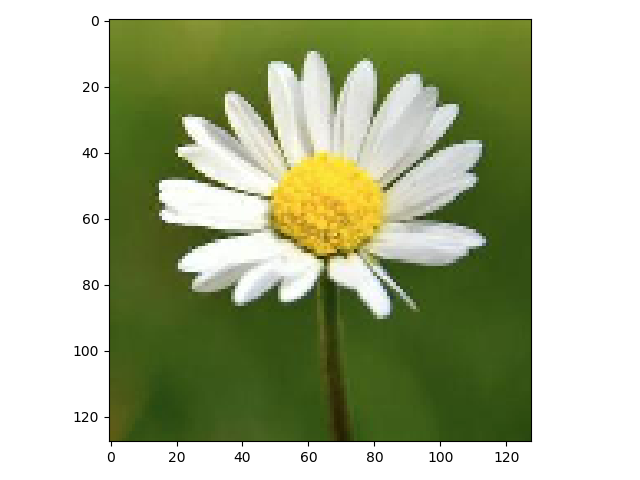
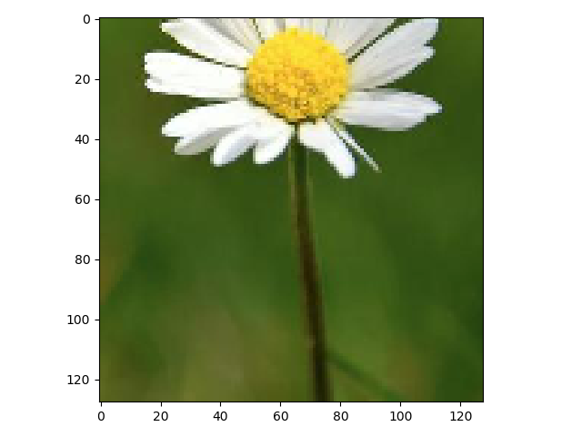

# HDF5 NCHW Image Dataset Maker

This is a simple image dataset creator with batch feeder for supervised/unsupervised computer vision model.
The preprocessing op is based on `tensorflow`'s `tf.image`.<br>

## 1. Installation
You can use this creator by cloning this repository.
And the dependencies of this project are as below:

```
tensorflow
numpy
numba
pillow
h5py
blosc
```
If you want to **just read** the dataset, you don't need to install `tensorflow` and `pillow`. These two packages are used in creating dataset.

## 2. Usage
### 1. Creating Dataset
#### 1. Basic Usage
You can use `build_dataset.py` when creating dataset.
```
$ python build_dataset.py [output_path] [images_path] [resolution]
```
- `output_path` : Dataset path
- `images_path` : Images data folder path
- `resolution` : Final image resolution(in px)

**IMPORTANT:**
The structure of the folder **must be** set as follows:
If `--unsupervised` is not set(defaults):

- The label of images is the name of first subfolder.
- The label name must be `int` like `1/path/to/image.jpg`

example of folders structure:
```
# images_path is main_folder/
main folder/
+-- <label_name>/
|   +-- path/to/image.jpg
|   +-- another/path/to/image.png
|
+-- <another_label_name>/
|   +-- path/to/image.jpg
|   +-- image.jpg
...
```

If `--unsupervised` is set:
- The structure of image folders is **not** restricted.

#### 2. Options
| Option           | Description                                                  | Usage                                                       |
| ---------------- | ------------------------------------------------------------ | ----------------------------------------------------------- |
| `--compress`     | Data compression method<br>More info: [Python `blosc` documentation](http://python-blosc.blosc.org/) | `biosclz`, `lz4`, `zlib`. `zstd`. `snappy`, `lz4hc`         |
| `--crop`         | Image cropping method<br>(For image whose ratio is not 1:1)<br>More info: Goto 2-1-3. *Cropping Method* | `center_crop`, `random_crop`<br>`resize_only`. `pad_resize` |
| `--resize`       | Image resizing method                                        | `bilinear`, `nearest`                                       |
| `--comp-level`   | Image compression level                                      | 0 to 9                                                      |
| `--iter`         | Iterations(Mostly not used)<br>When the image cropping method is `random_crop`, this mode generates the `iter`-randomly-cropped images from each source image. | any positive interger                                       |
| `--unsupervised` | If you don't want to store labels in your dataset, you can set this option. | -                                                           |

#### 3. Cropping Method
All of the image data is cropped(or padded) into square and then resized at the preprocessing step.<br>
So, the cropping method determines how to crop(or pad) wild image data into square.

| Method        | Description                                                  | Sample                                                       |
| ------------- | ------------------------------------------------------------ | ------------------------------------------------------------ |
| `center_crop` | Simple center crop                                           |                  |
| `resize_only` | The images will not be cropped.<br>The images will be squeezed into square. |                  |
| `pad_resize`  | The images will be padded into square.                       |                    |
| `random_crop` | The images will be cropped randomly.<br>(If the image data is 253x224, the processed result will be 224x224) | <br> |

### 2. Using Dataset
When using the created dataset, you just need to import `dataset_reader.py`.
```python
import dataset_reader as reader
```
And make `HDF5DatasetReader` class for getting batch data.
```python
batch_feeder = reader.HDF5DatasetReader('your/dataset/path.h5')
```
Done! You can use `get_batch` function when you need a batch data.
```python
batch_feeder.get_batch(batch_size, label=True)
```

The return of this function is tuple: `(image_batch_data, label_data)`<br>If `label=False` or the dataset is created in unsupervised mode, `label_data` will be `None`.
The shape of `image_batch_data` is `[batch_size, 3, resolution, resolution]`.<br>The shape of `label` is `[batch_size, 1]` or `None`.

This is the simple example of using `get_batch` function:
```python
import dataset_reader as reader
batch_feeder = reader.HDF5DatasetReader('dataset/foo.h5')
for step in range(10000):
    imgs, labels = batch_feeder.get_batch(batch_size=32, label=True)
    some_training_codes(imgs, labels)
```

## Further Work
- [ ] Support NHWC image format.
- [ ] Support grayscale image.
- [ ] Support image data range.

